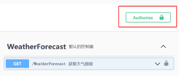

# Swagger包使用

## 修改csproj

首先修改csproj项目文件

**建议** 在 `PropertyGroup` 块中添加

```xml
<GenerateDocumentationFile>true</GenerateDocumentationFile>
```

可以自动根据注释生成xml文档, 无需手动指定

## 注册 swagger

给 `IServiceCollection` 做了三个扩展方法

* AddSwaggerWithComments: 带注释的swagger
* AddSwaggerWithJwtAuth: 带 jwt 按钮的 swagger
* AddDefaultSwaggerGen: 上面两个合并的 swagger
  * 


